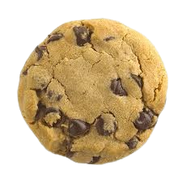

<html lang="en">
<head>
    <meta charset="UTF-8">
    <meta name="viewport" content="width=device-width, initial-scale=1.0">
    <title>Cookie Clicker</title>
    
</head>
<body>
    <h1>Cookie Clicker</h1>
    
    
0

    <button id="autoClicker" class="button" disabled>Buy Auto Clicker (10 cookies)</button>
    <button id="doubleCookies" class="button" disabled>Buy Double Cookies (50 cookies)</button>
    
</body>
</html>
