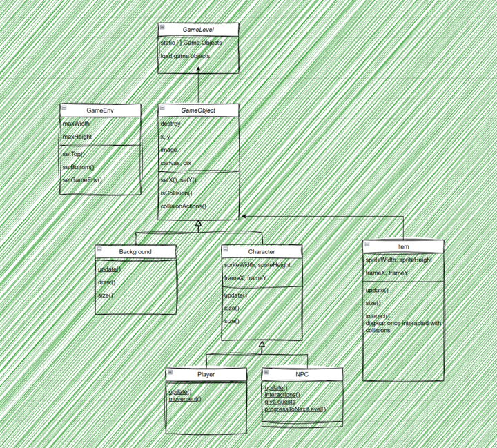
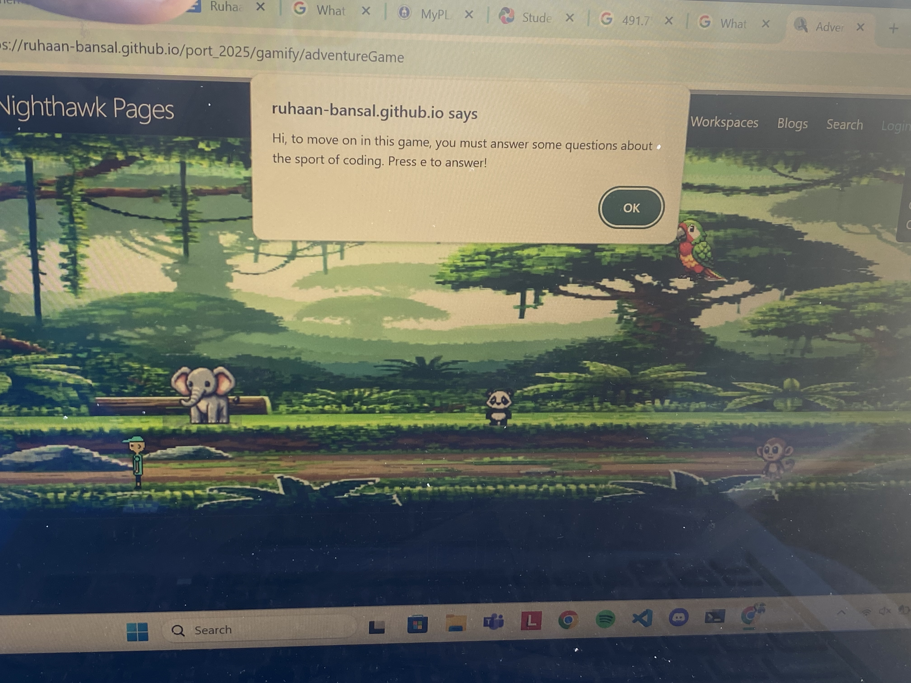

## Topics I have learned through CSSE

- I learned how to somewhat teach through Javascript lessons
- I learned the various tools such as WSL, Github, and navigating VSCode
- I learned how to tinker with different NPC properties in RPG
- I learned various linux commands such as cd, mkdir, and ls
- I learned how to work on a project with peers on the same repository
- 0.95/1 because I can effectively navigate through tools such as Github and VScode, and learned the basics of most javascript topics which greatly helped me tinker adventureGame
  
## RPG Game Tinkers

- I edited the message of the npc based on how many items you have left
- I randomized the spoon location every time you load into a new game
- I made it such that the knight collects the keys and transports you to the next level
- 0.91/1 because I learned about classes of npcs and items and changing their properties although I think I could have done more effective tinkers to really change and modify the game.
  
## RPG Game Tinkers Writeup

[RPG Tinkers and Explanations](https://pratheepnatarajan.github.io/pratheep_blog/csse/tinkers)

0.9/1 because I learned how to modify properties of Npcs and Items.

## N@TM Feedback for adventureGame

[N@tm feedback](https://docs.google.com/spreadsheets/d/1N3RdE7u8FmrMy4YJqBgZ6blaRfVy86lxbnwm_hsW23s/edit?gid=1486593086#gid=1486593086)

0.88/1 because feedback was mediocure due to 2-3 people being CSA students and the rest being CSSE1/2 students

## Reflection and Looking Foward

- I thought that it was cool that ruhaan added an interactive object in his adventureGame explaining how to progress in the game, and it sparked an idea for me to create a prompt at the beginning of the game to explain how the game works so that the player does not get confused when playing
  

### CompSci future goals

- Learning Game Coding/javascript to develop games in the future
- Take interest in other programming languages such as python and c++

### Individual Strengths and Weaknesses

- Collaberate with peers well
- Effectively can use various tools
- Struggle with coding sometimes
- Maybe be more creative and different
  
### Next steps

- Add more features to adventureGame using N@TM feedback
- Understand the game at a deeper level to make significant changes to the project
- 0.93/1 because I talked about improving adventureGame using N@TM feedback while providing a clear path to follow in CompSci
  
### Total

- 4.54/5